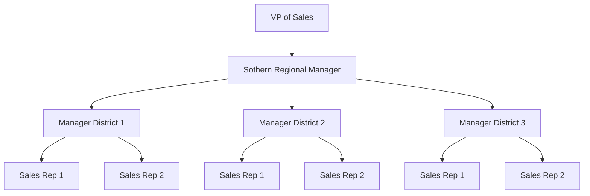

  

# Chapter 18: Personal Selling and Sales Promotion

## Learning Objectives

* Contrast the factors that favor use of personal selling versus advertising.
* Describe the four sales channels.
* Explain how each step in the sales process relates to the AIDA concept.
* Summarize the seven steps of the sales process.
* Describte the seven key functions of a sales manager.
* Summarize eight types of sales promotion.
* Given an example of market conditions and promotional objectives, identify the most effective promotional tactic.

### Learn It Today... Use It Tomorrow

Hormel is known for its pork, but has a wide range of products. Some are sold as consumer products, some to businesses like institutions and restaruants. As well as publicity and advertising, Hormel uses a large, multi channel sales force to help maximize their distribution.  

## 18.1 Personal Selling

"Contrast the facctors that favor using personal selling versus advertising."  

### Opening Example

Paul Joffre, owner of Windows & More, has used personal selling to build his business. Now he's thinking of adding advertising. How can he determine whether this is a good idea?  

### 18.1a Learning It: Personal Selling

**Personal selling** is an in person presentation directly to the buyer. It is the largest marketing expense in many organizations. Personal selling allows the marketer to understand and provide a solution to the needs of the buyer.  

Because of the cost of both advertising and personal selling, organizations must understand the right balance.  

  

    Comparison of Major Forms of Media
  

  

    <table class="zebra">
      <thead>
        <tr class="zebra">
          <th>Variable</th>
          <th>Conditions That Favor Personal Selling</th>
          <th>Conditions That Favor Advertising</th>
        </tr>
      </thead>
      <tbody>
        <tr class="zebra">
          <td class="zebra row-header">Consumer</td>
          <td class="zebra">
          Geographically concentrated  
          Relatively low numbers
          </td>
          <td class="zebra">
          Geographically dispersed  
          Relatively high numbers
          </td>
        </tr>
        <tr class="zebra">
          <td class="zebra row-header">Product</td>
          <td class="zebra">
          Expensive  
          Technically complex  
          Custom made  
          Special handling requirements  
          Transactions frequenlty involve trade-ins
          </td>
          <td class="zebra">
          Inexpensive  
          Simple to understand  
          Standardized  
          No special handling requirements  
          Transactions seldom involve trade-ins
          </td>
        </tr>
        <tr class="zebra">
          <td class="zebra row-header">Price</td>
          <td class="zebra">
          Relatively high
          </td>
          <td class="zebra">
          Relatively low
          </td>
        </tr>
        <tr class="zebra">
          <td class="zebra row-header">Channels</td>
          <td class="zebra">
          Relatively short
          </td>
          <td class="zebra">
          Relatively long
          </td>
        </tr>
      </tbody>
    </table>
  

&nbsp;

Examining these factors through the lense of Windows & More:  

* _Consumer Location:_ Most customers live within 60 miles of the showroom. This is about as far as Paul expects a customer would drive for products and services like his. Staying local also reduces his transportation costs. He wants to focus on the local area. This kind of geographic concentration favors personal selling.  
* _Number of Consumers:_ Any residential building over ten years old is a potential customer. Nationall,y this would favor advertising. But if Paul stays local, the number of customers drops dramatically and the cost of advertising might be too high for the return. Personal selling is again the prefered method.
* _Product Features - Complexity and Customization:_ Remodeling and window replacement can be a complex process and customizatoin is common. Personal selling would be appropriate.  
* _Channels:_ This is a direct to consumer product. There is no distributor, retailer, or other market intermediaries. Personal selling would be appropriate.

Advertising could still augment the marketing strategy, but it would need to be highly targeted and efficient.  

To be successful, personal selling needs to:  

* Focus on customer's needs, creating solution for those needs.
* Follow through before, durring, and after the sale.
* Know the industry, the organizations capabilities, and the abilities of the competition.
* Work hard to exceed customer expectations.

Building a good relationship with customers can drive future sales.  

### 18.1b Closing Example

By examining his business through the lense of personal selling vs. advertising, Paul Joffre has a better understanding of how important personal selling is to the success of his business. He also has a better idea of what he needs from advertising.  

## 18.2 The Four Sales Channels

"Describe the four sales channels."  

### Opening Example

Grainger provides over 1.5 million products to maintain, repair, and operate facilities. They distribute through multiple channels across the globe. How are different channels classified, what differenciates them, and why shoul companies use multiple sales channels?  

### 18.2a Learning It: The Four Sales Channels

Personal selling occurs through multiple sales channels:  

* Over-the-Counter Selling
* Field Selling
* Telemarketing
* Inside Selling

Each of these can be used for B2B or B2C selling.  

#### Over-the-Counter Selling

This is when the customer comes to the business to shop. Differenciators are the levels of customer service and sales representative knowledge.  

#### Field Selling

This is when the sales person goes to the home or place of business. Sometimes these are established customers, sometimes they are potential customers. Repeat customers typically use this channel to place orders. Sales reps may provide point of sale marketing materials like displays. Other situations may require a great deal of preperation, like learning about an industry inorder to close a sale with a new business customer.  

#### Telemarketing

This is when the selling process occurs over the phone. It includes inbound and outbound calls.  

_Outbound telemarketing_ is when the seller contacts the potential customer. While still very common in B2B marketing, consumers generally dislike it. It is significantly cheaper than field selling, because there are no transportation costs.  

_Inbound Telemarketing_ is when the customer contacts the business over the phone. Inbound reps may answer questions about the product, and typically take orders from the customer.  

#### Inside Selling

This is an advanced form of inbound telemarketing. These reps are well trained to answer customer questions, and convert calls into sales. They may develop repore, ask questions, identify needs and suggest solutions. It is common to use inside selling in conjunction with field representatives to provide well rounded support to customers, solidifying the relationship.  

### 18.2b Closing Example

Graniger uses all four types of sales channels to establish, reestablish, maintiain and solitify relationships with their customers.  

## 18.3 The Sales Process and AIDA Concept

"Explain how each step in the sales process relates to the AIDA concept."  

### Opening Example

In a hypothetical medical staffing agency, a sale is when one of their consultants are hired. The sales tem is well trained on the selling process, but their manager things they can benefit from learning more about how the sales process aligns with the AIDA concept. Which steps in the process provide the opportunity to create attention, interest, desire, and action?  

### 18.3a Learning It: The Sales Process and AIDA Concept

The personal selling sales process typically follows this sequence:  

1. Prospecting and qualifying
2. Approach
3. Presentation
4. Demonstration
5. Handling objections
6. Closing
7. Follow-up

  

    The AIDA Concept and the Personal Selling Process
  

  

    <table class="zebra">
      <thead>
        <tr class="zebra">
          <th>AIDA</th>
          <th>Personal Selling</th>
        </tr>
      </thead>
      <tbody>
        <tr class="zebra">
          <td class="zebra">Attention</td>
          <td class="zebra">
          Prospecting and Qualifying  
          Approach
          </td>
        </tr>
        <tr class="zebra">
          <td class="zebra">Interest</td>
          <td class="zebra">
          Presentation
          </td>
        </tr>
        <tr class="zebra">
          <td class="zebra">Desire</td>
          <td class="zebra">
          Demonstration  
          Handling Objections
          </td>
        </tr>
        <tr class="zebra">
          <td class="zebra">Action</td>
          <td class="zebra">
          Closing  
          Follow-Up
          </td>
        </tr>
      </tbody>
    </table>
  

&nbsp;

Sales people modify the steps of the sales process to match their customers' buying process.  

### 18.3b Closing Example

The sales manager believes that keeping the AIDA concept in mind will help her sales team improve outcomes.  

## 18.4 The Sales Process

"Summarize the seven steps of the sales process"  

### Opening Example

Derek Hernandez is a field sales representative for Sherwin-Williams. How does he use the sales process and why is it important to follow a sequential and deliberate process as a sales rep?  

### 18.4a Learning It: The Sales Process

Professional sales representitives typically follows this sequence of steps to create attention, interest, desire, and action:  

1. Prospecting and qualifying
2. Approach
3. Presentation
4. Demonstration
5. Handling objections
6. Closing
7. Follow-up

#### Prospecting and Qualifying

_Prospecting_ is the process of identifying potential customers. Leads come from online, trade shows, previous customers, friends, vendors, suppliers, socal and professional contacts, and other possible sources.  

_Qualifying_ is the process of identifying if a prospect is suitable to be a customer. NAME is an acronym for the qualifying criteria:  

* Does the prospect have a **N**eed for the product?
* Does the prospect have the **A**thority to make the purchase decision?
* Does the prospect have the **M**onitary resources to make the purchase?
* Is the prospect **E**ligible to purchase?

#### Approach

_Precall planning_ is the process of gathering relevent information about the potential customer and planning a customized _approach_. Information can be gathered through conversation, online research, other means. It should answer the following questions:  

* Who is the prospect and what are their responsibilities within the company?
* What is their knowledge level? How much do they know about the product?
* What needs or objectives do they have. Do they prefer general information or more detailed, technical information?
* What information is most important to them? What issues would drive their purchase decision?

The more a sales representitive knows about the person and their needs and objectives, the more likely they are to get to the next step in the process.  

#### Presentation

_Presentation_ is the however the sales representitive chooses to convey the markeing message to the prospect. It should be tailered to meet the prospect where he is and present features and benefits relevent to their needs and objectives.  

#### Demonstration

Personal selling allows the seller to demonstrate the product or how the product works, and possibly even allow the prospect to try the product.  

#### Handling Objections

_Objections_ are expressions of resistance by the prospect. It could be questions or concerns, or it could just be hesitation or uncertainty. These should be welcomed as an opportunity to reassure the prospect about the products features and benefits.  

#### Closing

_Closing_ is the point at which the seller asks for an order. If the presentation was successful and all objections have been handled, this should happen naturally. If there is still hesitation, some strategies that can be implemented include:  

* Addressing major concerns and offering a convincing argument.
* Posing choices in which either alternative results in a sale.
* Advising the prspect that the product is going to go away or up in price if they don't act.
* Remaining silent so the buyer can make the decision on their own.
* Offer extra inducements, like a quantity discount, low intrest payment plan, or an extended service contract.

#### Follow-Up

_Follow-up_ includes everything after the sale. The sales representitive should reinforce the purchase choice while strengthening the relationship, make sure the correct product was delivered to the buyer, that the product meets or beats expectations, that all customer service needs are met, and to work through any issues that may arrise.  

### 18.4b Closing Example

Derek uses the seven step sales process to insure he is an effective sales representitive. He has been well trained in this process.  

## 18.5 Sales Management Functions

"Describe the seven key functions of a sales manager."  

### Opening Example

As a district manager for the Federated Insurance Companies southeastern district, Keikilani Kapahu has many functions, and can sometimes feel overwhelmed. What would happen if she decided to ignore some of them?  

### 18.5a Learning It: Sales Management Functions

Typical regional sales organizations are heirarchial.  

  

    Example of Sales Organizational Chart
  

  

  

&nbsp;

The role of sales manager requires a mix of skills including managerial and sales skills. The higher in the hierarchy, the less sales and more managerial skills are required. A sales manager performs seven basic functions:  

1. Recruitment and selection
1. Training
1. Organization
1. Supervision
1. Motivation
1. Compensation
1. Evaluation and control

#### Recruitment and selection

Careful selection of sales people is important for two reasons:  

1. A company invests substantial sums of time and money in the selection process.
2. A hiring mistake can damage existing relationships, which is costly to fix.

For a sales manager, having the right sales people is necessary to achieve sales goals and to succeed in their role as manager.  

Gallup's Analytics-Based Hiring program can be used to identify candidates with the right qualities: personality, drive, and determination.  

#### Training

Sales managers are responsible for training their sales force.  

Methods used for training:  

* On-the-job training
* Individual instruction
* In-house classes
* External seminars

Popular training techniques:  

* Instructional videos
* Lectures
* role-playing exercises
* Interactive computer programs

Mentoring and executive development programs can also be effective.  

#### Organization

Sales managers are responsible for the organization of the field sales force territories. Alignment may be based on geography, products, types of customers, or some combination of these. Specialized sales forces are used for each major category of product being sold.  
  
#### Supervision

_Span of control_ refers to the number of sales people a front-line sales manager oversees. For technical or industrial sales people, a 6-1 ratio is appropriate. For representitives selling to wholesale and retail accounts, a 10-1 ratio is appropriate.  

#### Motivation

Information sharing, recognition, bonuses, incentives, and benefits can be used to help motivate sales people and maintain a positive and motivating environment.  

#### Compensation

Sales people can be compensated by commission, salary, or a combination of both. Bonuses based on end-of-year results are also part of compensation.  

_Commissions_ motivate sales people to sell, but may reduce motivation for non-sales activities, like servicing existing accounts. It may also may incentivise overly agressive selling, which is not good for company reputation, or selling.  

_Salaries_ give management more control over how sales people allocate their efforts, but can reduce incentives to find new accounts.  

#### Evaluation and control

Sales volume, profitability, and changes in market share are ways to evaluate the sales force. _Sales quotas_ can be used to set expectations, and can be tied to compensation.   

### 18.5b Ethical and Legal Issues in Sales

Long term success in sales requires a strong code of ehtics. A breach of this code could have a severe negative impact on their career. Economic downturns might influence some sales force to act outside this code. Companies should have a written code of conduct and be sure to create and enforce corporate cultures that reduce these opportunities, and encourage appropriate behavior.  

### 18.5c Closing Example

As a district manager for the Federated Insurance Companies southeastern district, Keikilani Kapahu knows to perform all seven functions of her role in order to be successful. These are:

1. Recruitment and selection
1. Training
1. Organization
1. Supervision
1. Motivation
1. Compensation
1. Evaluation and control
   
## 18.6 Sales Promotion

"Summarize eight types of sales promotions."  

### Opening Example

Paisley Lane Soaps is starting to establish distribution with grocery stores. They are considering consmer and trade oriented promotions. With a limited budget, what methods might be successful for them to use?  

### 18.6a Learning It: Sales Promotion

Once a short term incentive, sales promotion has become an integrated part of long-term marketing strategy. Where as advertising creates awareness, a sales promotion leads to a trial or purchase. Short duration promotions, like coupons or rebates, encourage immdeiate action before they expire, while longer term promotion, like loyalty programs, encourage repeat business.  

It's important to understand that short term promotions do not guarentee continued purchases after they end, and sales promotions will not overcome poor brand images, product deficiencies, or poor sales training.  

_Consumer-oriented sales promotion_ increase impulse purchases, encourage repeat purchases, boost sales of complementary products, and cut through advertising noise to attract consumer attention.  

    

  Forms of Consumer-Oriented Sales Promotion
  

  

    <table class="zebra">
      <thead class="top">
        <tr class="zebra">
          <th>Form of Sales Promotion</th>
          <th>Description</th>
          <th>Examples</th>
        </tr>
      </thead>
      <tbody>
        <tr class="zebra">
          <td class="zebra row-header">Coupons</td>
          <td class="zebra">
          Consumer is offered discounts on the purchase price of goods and services and redeem coupons at retail outlets.
          </td>
          <td class="zebra">
          Philadelphia Cream Chees distributing coupons by mail, magazine, newspaper, package insert, or via mobile phone.
          </td>
        </tr>
        <tr class="zebra">
          <td class="zebra row-header">Rebates</td>
          <td class="zebra">
          Consumers are offered cash back for sending in proof of purchase such as the receipt or Universal Product Code (UPC) from the product.
          </td>
          <td class="zebra">
          LG offering a $100 rebate when a buyer provides proof of purchase for a new LG television.
          </td>
        </tr>
        <tr class="zebra">
          <td class="zebra row-header">Sampling</td>
          <td class="zebra">
          Free distribution of a product in an attempt to obtain future sales.
          </td>
          <td class="zebra">
          Costco offering free samples to customers of various food items in the store.
          </td>
        </tr>
        <tr class="zebra">
          <td class="zebra row-header">Contests and Sweepstakes</td>
          <td class="zebra">Contests may require entrants to complete a task - such as uploading a picture - while anyone can enter a sweepstakes with an opportunity to win the advertised prize.
          </td>
          <td class="zebra">
          HGTV sponsoring a Dream Home Giveaway where viewers can register for a chance to win a luxury home.
          </td>
        </tr>
        <tr class="zebra">
          <td class="zebra row-header">Specialty Advertising</td>
          <td class="zebra">
          An advertiser's message or logo is placed on useful articles that are distributed to target consumers.
          </td>
          <td class="zebra">
          </td>
        </tr>
      </tbody>
    </table>
  

&nbsp;

_Trade-oriented promotion_ encourage reselleres to stock new items, continue to stock existing items, and promote these items effectively to the consumer.  

  

  Forms of Trade-Oriented Promotion
  

  

    <table class="zebra">
      <thead class="top">
        <tr class="zebra">
          <th>Form of Sales Promotion</th>
          <th>Description</th>
          <th>Examples</th>
        </tr>
      </thead>
      <tbody>
        <tr class="zebra">
          <td class="zebra row-header">Trade Allowances</td>
          <td class="zebra">
          Financial incentive offered to wholesalers and retailer that purchase or promote specific products.
          </td>
          <td class="zebra">
          A beverage company offering a retailer one free case of product for every 10 ordered.
          </td>
        </tr>
        <tr class="zebra">
          <td class="zebra row-header">Point-of-Purchase Advertising</td>
          <td class="zebra">
          Display or other promotion placed near the site of the actual buying decision.
          </td>
          <td class="zebra">
          A prominently placed cardboard display for Vitamin Water at the end of the aisle in the grocery store.
          </td>
        </tr>
        <tr class="zebra">
          <td class="zebra row-header">Trade Shows</td>
          <td class="zebra">
          Product exhibitions organized by industry trade associations to showcase goods and services.
          </td>
          <td class="zebra">
          Caterpillar participating in the MinExpo trade fair in order to interact with firms in the mining industry.
          </td>
        </tr>
        <tr class="zebra">
          <td class="zebra row-header">
          Dealer Incentives, Contests, and Training Programs
          </td>
          <td class="zebra">
          Manufacturers may offer incentive programs and contests to reward retailers and their salespeople who increase sales and promote specific products.
          </td>
          <td class="zebra">
          A clothing manufacturer running a sales contest among associates at retail stores who carry their goods.
          </td>
        </tr>
      </tbody>
    </table>
  

&nbsp;

### 18.6b Closing Example

Paisley Lane Soaps might benefit most by issuing coupons and rebates for their products, and by using limited samples in stores to encourage consumers to try their products. They could also offer distributors trade allowances and free point-of-sale promotional displays.   

## 18.7 Effective Promotional Tactics

"Given an example of market conditions and promotional objectives, identify the most effective promotional tactic."  

### Opening Example

Hormel continuously seeks to launch new products into the business and consumer markets. To succeed they must constantly consider how to leverage their promotional mix to be effective and efficient.  

### 18.7a Learning It: Effective Promotional Tactics

Marketers use a combination of methods to gain consumer awareness and stimulate demand. Personal selling allows for the use of multiple sales channels. Consumers or trade promotions are selected based on the given situation, budget, and marketing goals.  

When Hormel wants to sell a new meat product to a hotel, they recognize a short supply chain, and the importance of trade promotions and personal selling.  

When Hormel introduces a new consumer snack they recognize thelonger supply chain, wider geographical distribution, and low price of the product means focusing on advertising and consumer-oriented sales promotions like coupons and in-store sampling.  

### 18.8 Learn It Today... Use It Tomorrow

By carefully examining their situation, Hormel is able to select options that best achieve their organizational goals in an efficient mannor.  